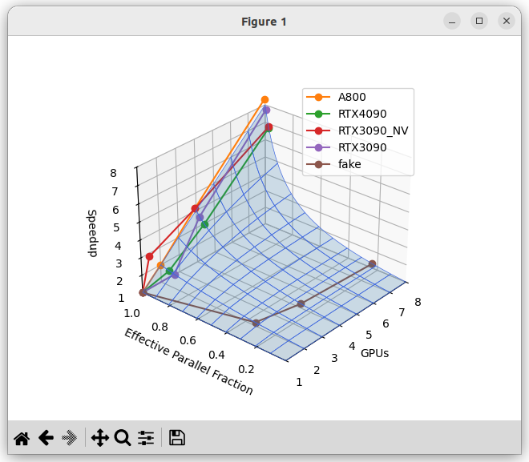

# Visualise Amdahl's and Gustaffon's law

Inspired by [this article](https://sinews.siam.org/Details-Page/life-after-fugaku-what-have-we-learned-and-how-do-we-proceed-as-the-end-of-moores-law-approaches).

Data from [this paper](https://arxiv.org/abs/2311.03687)




## Build
```bash
python -m venv venv
source venv/bin/activate
pip install -r requirements.txt
```
## Run
```
source venv/bin/activate
python3 visualise_accel.py 

```


